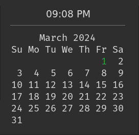

# popup_conky-calendar

## Description

This is a popup conky calendar for i3wm and polybar.

I didn't like any of the options provided from other sources and wanted my own custom popup calendar, Conky was more customizable then anything else I found, With the help of polybar and i3wm scratchpad I was able to make the conky calendar a popup window.

I am sure it can be customized to work with other window managers and bars.

## Eye Candy



##  Dependencies

* `conky`

* `lua`

* `polybar`

* `i3`

### Fonts Used

* [FiraMono Nerd Font](https://www.nerdfonts.com/font-downloads): A Mono font is required to display the Calendar, You can change it in the conky-calendar file with your own choice of Mono Font.

* [FiraCode Nerd Font](https://www.nerdfonts.com/font-downloads): Used for the Time, This is Optional and Can be changed in conky-calendar file to your choice of Font

##  Setup

* Install the dependencies above.

* Install the Fonts above or your choice of Fonts. Reminder: A Mono Font is required for the Calendar.

* Download the Source Code archive and extract the `popup_conky-calendar` directory to your conky directory. 
  Example: `~/.config/conky/`

* Copy the polybar module Example below into your polybar configuration file.

* Copy the i3wm Startup below into your i3wm configuration file.

##  Customization

* Change popup position in the Polybar Module. 
  Example: `position 0 px 1861 px`
  
* Change horizontal bar color: Change with an already provided color in `~/.config/conky/popup_conky-calendar/images`
  Or customize in gimp or equivilant.

* Change Calendar accent color in `~/.config/conky/popup_conky-calendar/cal.lua` to your conky colors. 
  Example: `conky_color = "${color0}%2d${color}"`
  
* [auto_scratchpad](https://github.com/KJoke70/i3-tools/blob/master/auto_scratchpad.py): A script to automatically move a   window matching certain criteria to the scratchpad upon focus loss
  
##  Example

### Polybar Module
```ini
[module/date]
type = internal/date
interval = 1
date = "%a %b %d, %Y"
date-alt = "%a %b %d, %Y"
time = "%l:%M%p"
time-alt = "%l:%M%p"
format-foreground = ${colors.foreground}
format-background = ${colors.background}
label = %{A1:i3-msg [class="conky-calendar"] scratchpad show move position 0 px 1861 px:}%date% %time%%{A}
```
### i3wm Startup
```ini
$exec 'conky -c ~/.config/conky/popup_conky-calendar/conky-calendar' move scratchpad
```
